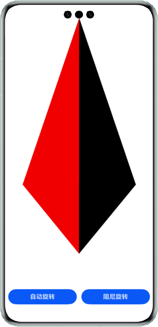
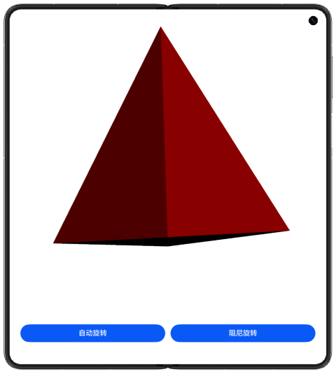
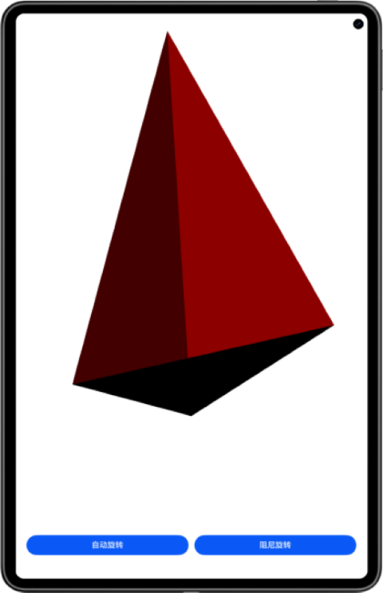

# 多几何体 3D 渲染

## 介绍

本示例基于 Native C++ 模板，调用 OpenGL ES 图形库 API 绘制 3D 图形，并通过 XComponent 控件渲染到屏幕。

支持 **8 种几何体**：四面体、球体、正方体、圆锥，以及椭球面、单叶双曲面、椭圆抛物面、椭圆锥面四种自定义参数曲面。提供**模型选择**和**参数编辑**页面，支持实时缩放（0.3× ~ 2.5×）和触摸旋转。

| 直板机 | 双折叠（Mate X 系列） | 平板 |
|:---:|:---:|:---:|
|  |  |  |

## 功能特性

- **8 种几何体**：4 种基础模型 + 4 种自定义参数曲面
- **模型选择页**：列表式浏览，点击即可切换
- **参数编辑页**：通过滑块实时调整曲面方程参数（a/b/c + 分辨率）
- **缩放控制**：底部滑块（0.3× ~ 2.5×），通过 Shader 缩放矩阵实现零开销实时调节
- **旋转控制**：自动旋转 / 阻尼旋转 / 触摸滑动手势旋转
- **光照**：简单漫反射光照模型（固定白色光源）
- **一多适配**：自适应直板机、折叠屏、平板，竖屏旋转自动避让摄像头区域

## 工程目录

```
├──entry/src/main/cpp/
│  ├──CMakeLists.txt                              // cmake 编译配置
│  ├──module.cpp                                  // NAPI 模块注册（含 XComponent 回调绑定）
│  ├──app_napi.cpp                                // NAPI 接口实现（模型切换/参数设置/缩放）
│  ├──tetrahedron.cpp                             // OpenGL ES 渲染 + 8 种几何体生成器
│  ├──frame_handle.cpp                            // 帧动画手柄
│  ├──napi_manager.cpp                            // NAPI 管理器（XComponent 生命周期）
│  ├──napi_util.cpp                               // NAPI 工具函数
│  ├──include/
│  │  ├──tetrahedron.h                            // 几何体类 + ShapeType 枚举 + ShapeParams
│  │  ├──app_napi.h                               // AppNapi 类声明
│  │  ├──frame_handle.h                           // 帧手柄声明
│  │  └──util/
│  │     ├──log.h
│  │     ├──napi_manager.h
│  │     ├──napi_util.h
│  │     └──native_common.h
│  └──type/libentry/
│     ├──index.d.ts                               // TypeScript 类型声明
│     └──oh-package.json5
├──entry/src/main/ets/
│  ├──entryability/
│  │  └──EntryAbility.ets
│  ├──pages/
│  │  ├──Index.ets                                // 主页面（XComponent + 滑块 + 按钮）
│  │  ├──ModelSelectPage.ets                      // 模型选择页
│  │  └──ParamEditPage.ets                        // 参数编辑页
│  └──utils/
│     ├──ModelTypes.ets                           // 模型类型、参数、方程定义
│     ├──Constants.ets                            // 常量定义
│     └──Logger.ets                               // 日志工具
└──entry/src/main/resources/                      // 应用静态资源目录
```

## 架构说明

### 渲染管线

```
顶点数据 → 旋转矩阵(a_mx·a_my) → 缩放矩阵(u_scale) → 漫反射光照 → 片段输出
```

- **顶点着色器**：几何体顶点经旋转/缩放矩阵变换后，计算 N·L 漫反射强度
- **片段着色器**：透传插值颜色
- **光照模型**：固定方向白色光源，简单 N·L 漫反射

### NAPI 桥接层

| 接口 | ArkTS 调用 | 说明 |
|------|-----------|------|
| `selectShape(type)` | `tetrahedron_napi.selectShape(0)` | 切换几何体（0=四面体 … 7=椭圆锥面） |
| `setShapeParams(p)` | `tetrahedron_napi.setShapeParams({...})` | 设置自定义曲面参数 |
| `setScale(s)` | `tetrahedron_napi.setScale(1.5)` | 实时缩放（0.3 ~ 2.5） |
| `updateAngle(x,y)` | `tetrahedron_napi.updateAngle(x,y)` | 触摸旋转角度更新 |
| `setRotate(mode)` | `tetrahedron_napi.setRotate(0)` | 旋转模式（自动/阻尼/停止） |

### 几何体类型

| 枚举值 | 名称 | 类型 | 参数 |
|--------|------|------|------|
| 0 | 四面体 (Tetrahedron) | 基础 | — |
| 1 | 球体 (Sphere) | 基础 | paramA=半径 |
| 2 | 正方体 (Cube) | 基础 | paramA=边长 |
| 3 | 圆锥 (Cone) | 基础 | paramA=半径, paramC=高度 |
| 4 | 椭球面 (Ellipsoid) | 曲面 | a, b, c = 三轴半径 |
| 5 | 单叶双曲面 (Hyperboloid) | 曲面 | a, b, c = 曲面参数 |
| 6 | 椭圆抛物面 (Paraboloid) | 曲面 | a, b = 开口参数, c = z轴缩放 |
| 7 | 椭圆锥面 (Elliptic Cone) | 曲面 | a, b = 椭圆截面, c = z轴斜率 |

## 具体实现

应用启动时，NAPI 模块初始化并注册 XComponent 生命周期回调。XComponent 创建 Surface 后触发 `OnSurfaceCreated` → 调用 `Tetrahedron::Init()` 建立 EGL 上下文、编译着色器 → 进入渲染循环。

ArkTS 侧通过 `import tetrahedron_napi from 'libtetrahedron_napi.so'` 导入 NAPI 模块，调用上述接口控制渲染。

主要源码参考：[tetrahedron.cpp](entry/src/main/cpp/tetrahedron.cpp)、[app_napi.cpp](entry/src/main/cpp/app_napi.cpp)、[module.cpp](entry/src/main/cpp/module.cpp)。

## 相关权限

不涉及。

## 依赖

- OpenGL ES 3.1+
- EGL

## 约束与限制

1. 本示例仅支持标准系统运行，支持设备：直板机、双折叠（Mate X 系列）、平板。
2. HarmonyOS 系统：HarmonyOS 5.0.5 Release 及以上。
3. DevEco Studio 版本：DevEco Studio 5.0.5 Release 及以上。
4. HarmonyOS SDK 版本：HarmonyOS 5.0.5 Release SDK 及以上。
